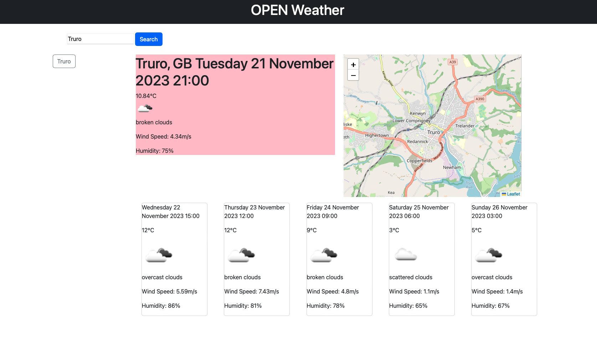
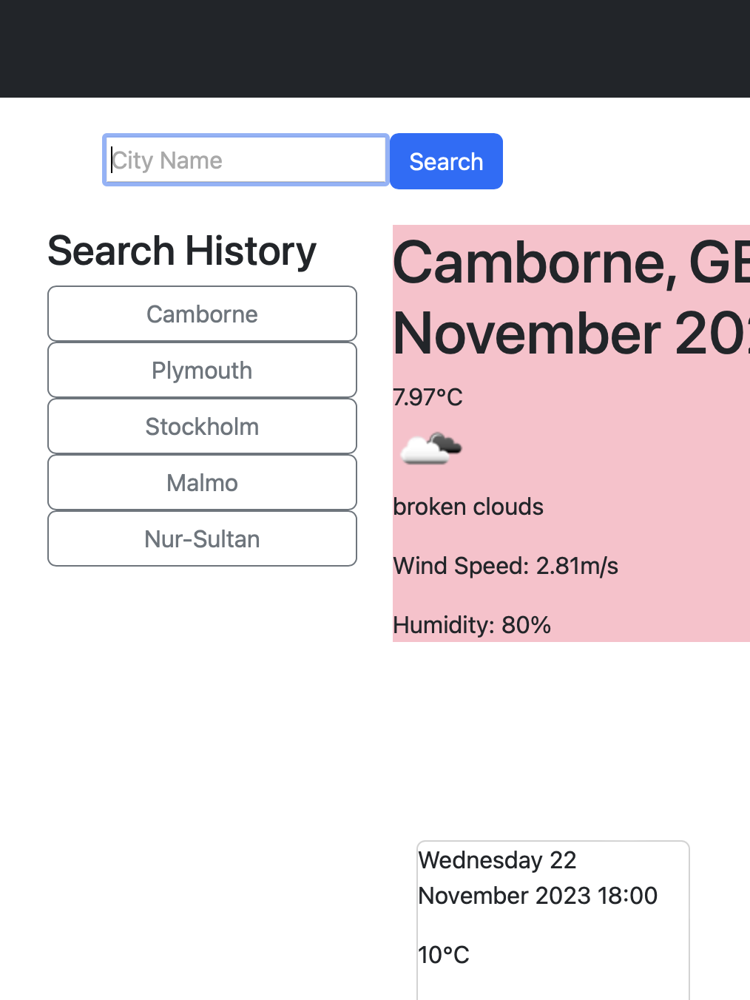
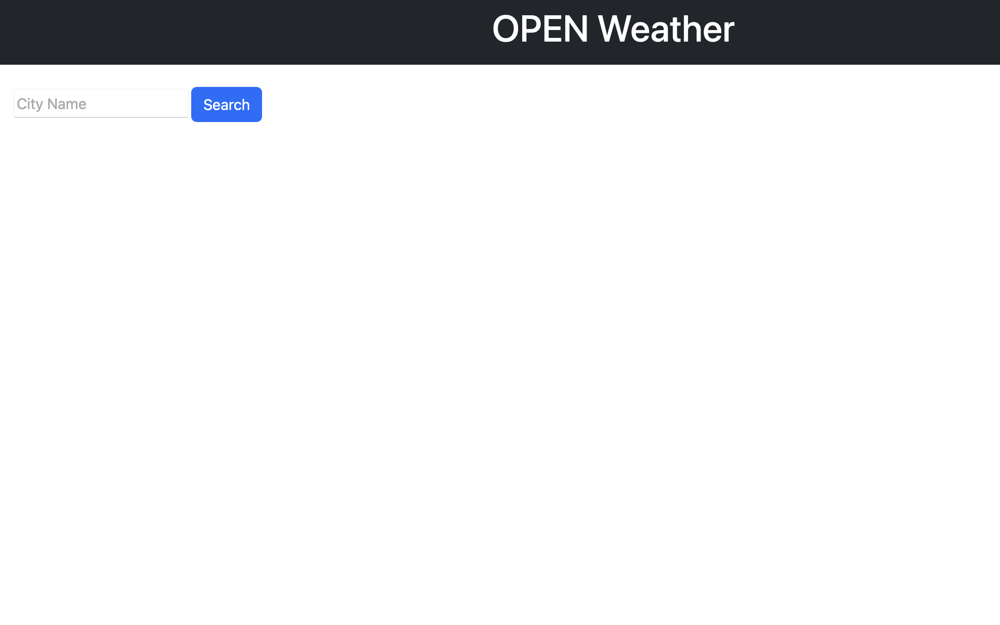

# weather-forecast-dashboard

### About:
This is a weather forecast dashboard that runs in the browser and features dynamically updated HTML and CSS. It uses the [OpenWeather API](https://openweathermap.org/api) to retrieve weather data for cities. It uses `localStorage` to store any persistent data.

### User Story:
The user story which has guided this project is as follows:

    AS A traveler
    I WANT to see the weather outlook for multiple cities
    SO THAT I can plan a trip accordingly

### Brief:
The following criteria are define the functionality which have been implemented in the application as deployed. Please contact myself at aiden_graham94@outlook.com to advise of any issues/bugs which you discover upon use.

1. When a user searches for a city they are presented with current and future conditions for that city and that city is added to the search history.

2. When a user views the current weather conditions for that city they are presented with:
    The city name
    The date
    An icon representation of weather conditions
    The temperature
    The humidity
    The wind speed

3. When a user views future weather conditions for that city they are presented with a 5-day forecast that displays:
    The date
    An icon representation of weather conditions
    The temperature
    The humidity
    When a user clicks on a city in the search history they are again presented with current and future conditions for that city.

In addition to the base requirements I have also implemented the following:

4. User is presented with a map of the city they have searched for.

5. When an item is drawn from history the map is updated to reflect the "new" city.

### How to use:
1. Navigate to the following URL:  https://ag466.github.io/weather-forecast-dashboard
2. Enter a city name into the search bar and click the search button.
3. Use the search history to navigate to previously searched cities.

### Screenshot:


### Notes on Code;
The following is a brief overview of the code structure and functionality of the application.

#### Current and Five Day Forecast:
###### Step 1. 

Prior to any requests and API calls a complex object consisting of an object and an array of objects is initialised. This complex object is used later in the code to store the data returned from the API calls. 

```
let weatherNow = {
    town: "",
    country: "",
    date: "",
    temp: "",
    icon: "",
    description: "",
    wind: "",
    humidity: "",
    lat: "",
    lon: ""
}

// declares an array to store the 5 day weather forecast
let fiveDays = [
    {
        ref: "",
        date: "",
        temp: "",
        icon: "",
        description: "",
        wind: "",
        humidity: "",
    },
    {   ref: "",
        date: "",
        temp: "",
        icon: "",
        description: "",
        wind: "",
        humidity: "",
    },
    {
        ref: "",
        date: "",
        temp: "",
        icon: "",
        description: "",
        wind: "",
        humidity: "",
    },
    {
        ref: "",
        date: "",
        temp: "",
        icon: "",
        description: "",
        wind: "",
        humidity: "",
    },
    {
        ref: "",
        date: "",
        temp: "",
        icon: "",
        description: "",
        wind: "",
        humidity: "",
    }
]
// declares a complex object to store the current and 5 day weather forecast
let forecast = {
    current : weatherNow,
    fiveDay : fiveDays
}


```


The text entered into the search bar at the top left of the appliction is stored as a varaible once the adjacent "submit" button is clicked. 

Given that the search bar is a component of a form, prevent default is essential here to prevent the page from reloading when the button is clicked.

###### Step 2. 
The text entered into the search bar is then used to generate a URL which is used to make a fetch request to the OpenWeather API. The response is then converted to JSON format. This initial request is to gain the coordinates in terms of latitude and longitutde - abbreviated to "lat" and "lon" in code.

```
let queryURL = "https://api.openweathermap.org/data/2.5/forecast?q="+city+"&appid=" + apiKey;

```

Further information about the "Geocoding API"  used in this initial request can be found at the following link: 

[[https://openweathermap.org/api/geocoding-api]]

(Open Weather API, 2023 - Last Accessed 21/11/2023)

```
 fetch(queryURL)
    .then(function(response) {
    return response.json(); 
    }
    ).then(function (geographyData) {
        console.log(geographyData);
        lat = geographyData.city.coord.lat;
        console.log(lat);
        lon = geographyData.city.coord.lon;
        console.log(lon);
       
```
The resulting object is then subsequently passed to secondary api which returns the weather object used to gain the current and five-day weather forecast.

```

        let weatherUrl = "https://api.openweathermap.org/data/2.5/forecast?lat="+lat+"&lon="+lon+"&appid=" + apiKey + "&units=metric";
        fetch(weatherUrl)
        .then(function(response) {
            return response.json(); 
            }).then(function (weatherInfo) {
                getCurrentWeather(weatherInfo);
                getFiveDayWeather(weatherInfo);
                console.log(weatherInfo);

                });
            });

```

Further information regarding this secondary API can be found via the following link:

[[https://openweathermap.org/forecast5]]

(Open Weather API, 2023 - Last Accessed 21/11/2023)

###### Step 3. 
Following the chaied API calls the object which forms the base of this application is now available to be displayed to the various elements comprising the site. Full details of the object returned can be found via the following link:

[[https://openweathermap.org/forecast5]]

###### Step 4. 
The function getCurrentWeather() is used to display the current weather conditions for the city searched for. This function is passed the object returned from the API call. The function then uses the object to update the HTML elements which display the current weather conditions. 

In this stage, a map object is initialised using the leaflet api. The map is then displayed in the HTML element with the id "mapid". The map is then centred on the coordinates returned from the API call. The map is then populated with a marker which is also centred on the coordinates returned from the API call.

Details on the Leaflet API are available from the following site:
[[https://leafletjs.com/reference.html]]

(Leaflet API, 2023 - Last Accessed 21/11/2023)

###### Step 5.
The function getFiveDayWeather() is used to display the five day weather forecast for the city searched for. This function is passed the object returned from the API call outlined previously.

The function getFiveDayWeather relies on a for loop which iterates through the weather objects. 

```


                for (let i = 0; i < 5; i++) {
                    
                    if(j <= 40){

                    let fiveDayDivs = $("<div>");
                    
                    
                    
                    fiveDayDivs.addClass("col-2");
                    fiveDayDivs.addClass("day"+i);
                    fiveDayDivs.addClass("card");
                    // fiveDayDivs.attr("data-id", i);
                    
                    forecast.fiveDay[i].ref = "day" + i;
                    
                    
                    let date = $("<p>");
                    date.attr("data-dateid", i);
                    forecast.fiveDay[i].date = dayjs(weatherObject.list[j].dt_txt).format('dddd DD MMMM YYYY HH:mm');
                    date.text(forecast.fiveDay[i].date);
                    fiveDayDivs.append(date);
                
                    let temp = $("<p>");
                    temp.attr("data-tempid", i);
                    forecast.fiveDay[i].temp = Math.round(weatherObject.list[j].main.temp);
                    temp.text(forecast.fiveDay[i].temp + "°C");
                    fiveDayDivs.append(temp);
                
                    let icon = $("");
                    icon.attr("data-imgid", i);
                    icon.css("width", "20%");
                    forecast.fiveDay[i].icon = weatherObject.list[j].weather[0].icon + ".png";
                    icon.attr("src", "http://openweathermap.org/img/w/" + forecast.fiveDay[i].icon);
                    fiveDayDivs.append(icon);

                    let description = $("<p>");
                    description.attr("data-descid", i)
                    forecast.fiveDay[i].description = weatherObject.list[j].weather[0].description;
                    description.text(forecast.fiveDay[i].description);
                    fiveDayDivs.append(description);

                    let wind = $("<p>");
                    wind.attr("data-windid", i)
                    forecast.fiveDay[i].wind ="Wind Speed: " +weatherObject.list[j].wind.speed + "m/s";
                    wind.text(forecast.fiveDay[i].wind);
                    fiveDayDivs.append(wind);
                    
                    let humidity = $("<p>");
                    humidity.attr("data-humid", i)
                    forecast.fiveDay[i].humidity = "Humidity: " + weatherObject.list[j].main.humidity + "%";
                    humidity.text(forecast.fiveDay[i].humidity);
                    fiveDayDivs.append(humidity);

                    weatherStats.append(fiveDayDivs);
                    $("#five-day-view").append(weatherStats);
                    
                    j = j + 7;
                    
                    }
                    
                }

```

It is important here to state that the object which is used in this code contains 40 data points relating weather the current weather is simply the weather which is the first of the 40 data points. 

The five day forecasts are comprised of data points from the remaining 39 data points. The first day is an offset data point 6. (hence the initialisation of the array to start from 6 in virtue of variable j). The remaining data points are then selected by incrementing the variable j by 7. This provides a maximal spread throughout the information available in the object.

###### Step 6.
At completion of the main line of code. The object used in the instance of the application is stored in local storage.

A button is created with the name of the location queried and appended to the DOM.

And the location is added to an array called history.


#### Search History:

Search history is generated by clicking the buttons appended in stage 6. of the main body of code.



The buttons have event handlers listening for a click. Each button has a data name which is equal to the name of the location queried. When the button is clicked data is retrieved from local storage where all information is stored in a key-value paring where the key is equal to the name of the city, and the value is the object which was retrieved for that location from the API.

The map is first reinitialised at this point with the coordinate pairs retrieved from the local storage object. The map is then appended to the DOM.

Subsequenlty, the elements which display the current weather information are re-values to the values stored in the retrieved local storage object.

Finally, the five day forecast is reinitialised with the values stored in the retrieved local storage object. As the retrieved object is an abridgement of the API object (In that it only contains the objects from the forecast object) it has been essential to depend on the data values which have been attributed to each of the elements at from the execution of the getFiveDayWeather function.

Through data values, fine grained management of the data is possible. Values can eaily be assigned by referencing the counters value with a specific card container.  

#### Future Steps:

The application in its current form has a rudimentary design. By adding further CSS the application could be made more visually appealing. As functionality was given primacy of concern, it will be for others to use the CSS to implement more compelling design.


Changes to the history array and the relevant iterators can easily be made to increase/decrease the number of cities which can be stored in the history array.

Lastly, the application at first load lacks content. It would be possible to add a default city to the application which would be displayed at first load. This would be a simple addition to the code, but is something which I have not implemented in this instance.

